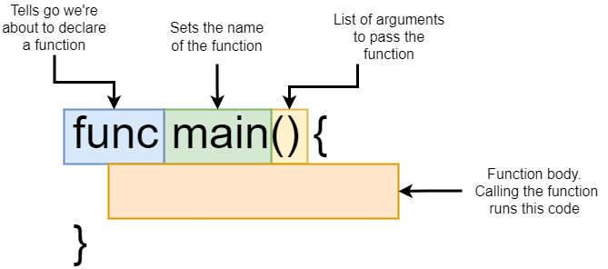

- [1. A simple start](#1-a-simple-start)
  - [1.1. Go commands](#11-go-commands)
  - [1.2. Go packages](#12-go-packages)
  - [1.3. Import statements](#13-import-statements)
  - [1.4. File organization](#14-file-organization)


# 1. A simple start
```go
package main

import "fmt"

func main () {
	fmt.Println("Hi there")
}
```

## 1.1. Go commands
1. After installing golang runtime, we can use several commands in terminal with golang cli. 
   1. `go build` - Compiles a bunch of golang source code files.
      1. On Windows, this generates an executable.
   2. `go run` - Compiles and executes one or two files.
   3. `go fmt` - Formats all the code in each file in the current directory.
   4. `go install` - Compiles and "installs" a package.
   5. `go get` - Download the raw source code of someone else's package.
   6. `go test` - Runs any tests associated the current project.

## 1.2. Go packages
1. `package main` 
   1. "Package" == "Project" == "Workspace"
   2. We can declare this one on the first line of the code files and change `main` to anything else.
   3. This build relationship between files and indicates that files are in the same "project".
2. Packages are seperated into
   1. Executable - Generates a file that we can run.
   2. Reusable - Code used as 'helpers'. Good place to put reusable logic. 
3. For `package main` is to specify if golang runtime should build the code as executable. 
   1. Every main package must have a function called `name`. 
      ```go
      package main

      func main () {
        // main code
      }
      ```
4. If `package [reusable_module]` is named with something else, 
   1. Go runtime won't generate it as executable.
   2. Defines a package that can be used as a dependency (helper code).

## 1.3. Import statements
1. `import fmt` means to allow the current context (which is `package main` in this case) access all the code. 
2. `fmt` is a standard lib. We can find the other packages in standard library at [https://pkg.go.dev/std](https://pkg.go.dev/std)

## 1.4. File organization
1. `func` is the keyword for `function` in golang
   
2. In a golang code file, it starts with 
   1. Package declaration
   2. Import other packages that the code needs
   3. Declare functions, tell golang to do things

```go
package main // package declaration

import "fmt" // import packages to use 

// declare function to work
func main () { 
	fmt.Println("Hi there")
}
```
